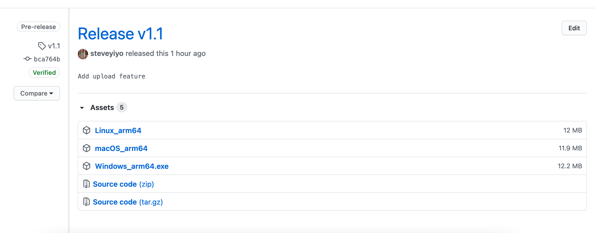
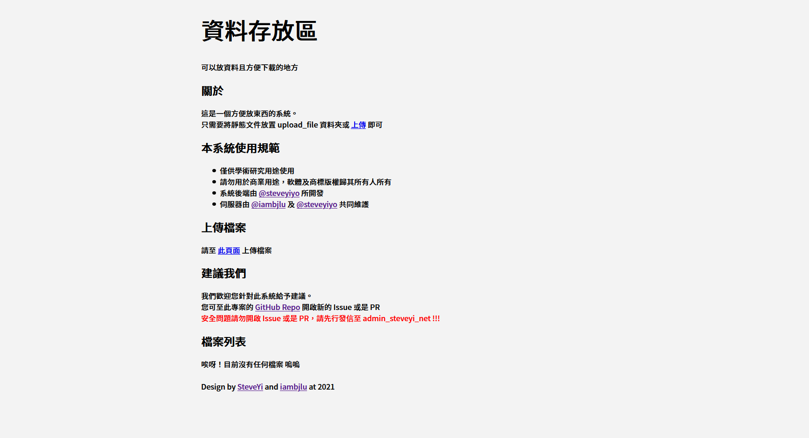
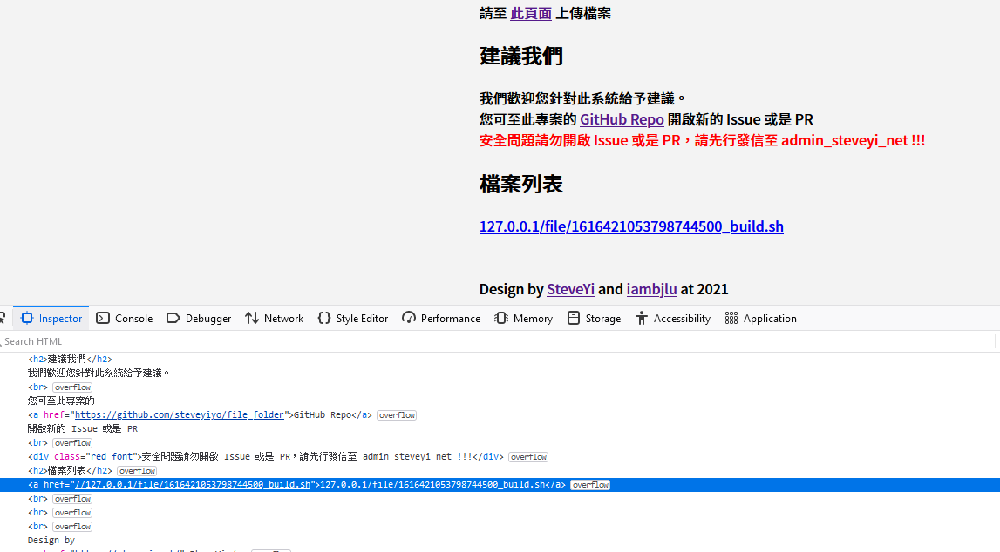

# File Folder System

一個像圖床一樣，可以上傳和下載檔案的系統

### 如何使用？

1. 下載編譯完的執行檔檔案和 [一些附件](https://github.com/steveyiyo/file_folder/releases/download/v1.0/file_folder.zip)。

2. 將 zip 檔案解壓縮為資料夾，並將執行檔拷貝進去。

3. 點開檔案執行！

**附帶說明：您可以在 static 目錄中編輯網頁。**
**請注意不要占用到 「連接埠 80」，否則程式會無法運作**

### 螢幕快照

